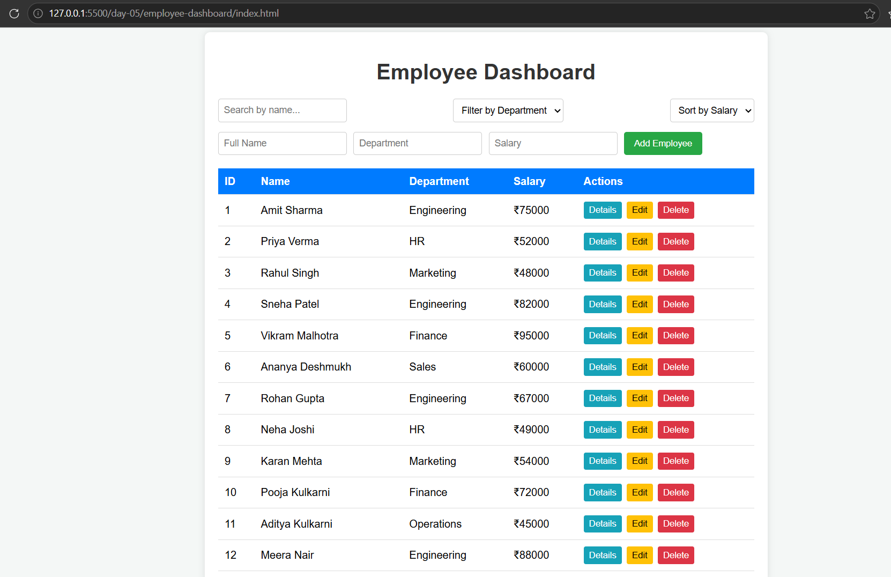

# Day 5: Modern JavaScript & Employee Dashboard

## 1. Project Overview
This project focuses on learning modern JavaScript concepts, asynchronous programming, and REST APIs. As part of the practical assignment, a responsive Employee Dashboard was built using vanilla JavaScript, HTML, and CSS to handle complete data operations.

## 2. Problem Statement
To build an interactive front-end dashboard that consumes mock JSON/API data and efficiently manages employee records with features like real-time searching, sorting, filtering, and full CRUD (Create, Read, Update, Delete) capabilities without using heavy external frameworks.

## 3. Features Implemented
- **Listing & Rendering:** Dynamically creates table rows using modern array methods like `map`.
- **Search & Filter:** Real-time filtering of employees by name or department using `filter`.
- **Sorting:** Orders employee salaries or names in ascending or descending order using `sort`.
- **Add & Edit:** Manages state changes cleanly using object spread operators (`...`) and destructuring.
- **Delete:** Removes records efficiently from the interface and state.

## 4. Technology Stack
- **Languages:** HTML5, CSS3, Modern JavaScript (ES6+)
- **Concepts Used:** Arrow functions, Closures, Promises, `async/await`, Fetch API

## 5. Architecture
The project is structured cleanly to separate core JS practice logic from the actual dashboard application interface.

## 6. Project Structure
```text
day-05/
├── javascript/
│   └── basics_practice.js
├── employee-dashboard/
│   ├── index.html
│   ├── style.css
│   └── app.js
└── README.md
```

## 7. Installation & How to Run
Navigate to the day-05/employee-dashboard/ folder.

Open the index.html file directly in any modern web browser.

(Optional) Run using a local development server like Live Server in VS Code for API/JSON fetching simulation.

## 8.Screenshot


## 9. Challenges Faced & Solutions
Challenge: Managing state updates cleanly during dynamic Add and Edit actions.

Solution: Used ES6 spread syntax (...) to ensure immutable state handling and predictable UI re-rendering.

## 10. Future Improvements
Integrate with a live backend REST API (Node.js/Express) instead of mock local JSON data.

Add local storage persistence so data remains saved on page refresh.