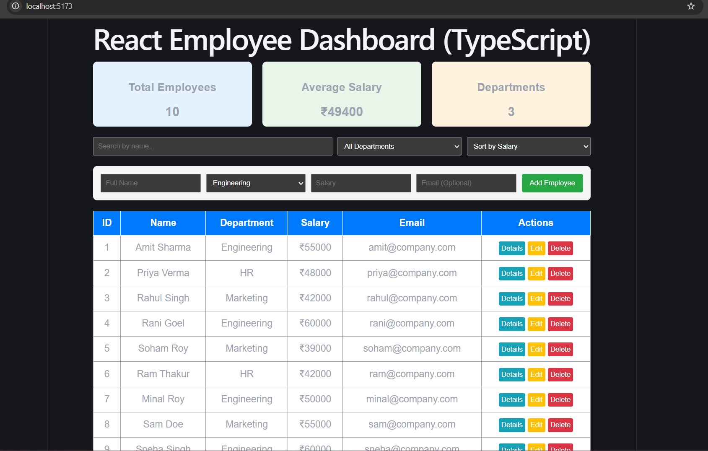

# Day 6: TypeScript + React Employee Management Dashboard

## Project Overview
This project is part of the 10-Day Intern Technical Training & Domain Assessment Program. It successfully upgrades the Day 5 Vanilla JavaScript employee dashboard into a modern, component-based **React and TypeScript** web application.

## Problem Statement
Managing employee records using basic JavaScript and manual DOM manipulation is inefficient, prone to runtime errors due to lack of type safety, and difficult to scale. This project solves this by introducing a strongly-typed, component-based React and TypeScript architecture for seamless employee data management.

## Features
- **TypeScript Safety:** Strongly typed interfaces (`Employee`) and state management.
- **Summary Metrics:** Real-time calculation and display of Total Employees, Average Salary, and Unique Departments.
- **CRUD Operations:** Fully functional features to Add, Edit, View Details, and Delete employee records.
- **Interactive Filters & Sorting:** Instant search by name, department filtering, and salary sorting (Low-to-High / High-to-Low).
- **Form Validation:** Mandatory field verification before submitting employee data.

## Technology Stack
- **Frontend Library:** React 18 (Vite template)
- **Language:** TypeScript
- **Styling:** CSS & Inline Styles

## Architecture & Project Structure
```text
day-06/
├── typescript/          # Core TypeScript practice exercises & logic
└── react-app/           # Component-based React application
    ├── public/          # Static assets
    ├── src/             # Source components and hooks
    ├── package.json     # Dependencies & scripts
    └── README.md
```
## Installation
Ensure Node.js is installed, then install the required project dependencies:

cd react-app
npm install

## Environment Variables
No environment variables (.env) are required for running this local React development server.

## How to Run
Navigate to the React app folder: cd react-app

Start the local development server:

npm run dev
Open the provided localhost link in any web browser.

## Screenshots
### React Employee Dashboard UI


## Challenges Faced
Type Mismatches: Handling strict TypeScript types and optional properties across dynamic form inputs and employee state objects initially triggered compilation warnings.

State Synchronization: Managing real-time metrics (like average salary and unique departments) dynamically during CRUD updates required careful React state structuring.

Solutions
Solution 1: Defined clear, robust TypeScript interfaces and explicit type guards for all employee records and form payloads.

Solution 2: Leveraged React's hooks (useState) efficiently to recalculate summary metrics automatically whenever the employee list changes.

## Future Improvements
Integrate backend REST APIs (Node.js/Express or Laravel) to persist employee data in a relational database.

Implement robust form validation libraries (such as Formik or React Hook Form with Zod).

Add advanced pagination and export-to-CSV functionality for large corporate datasets.
