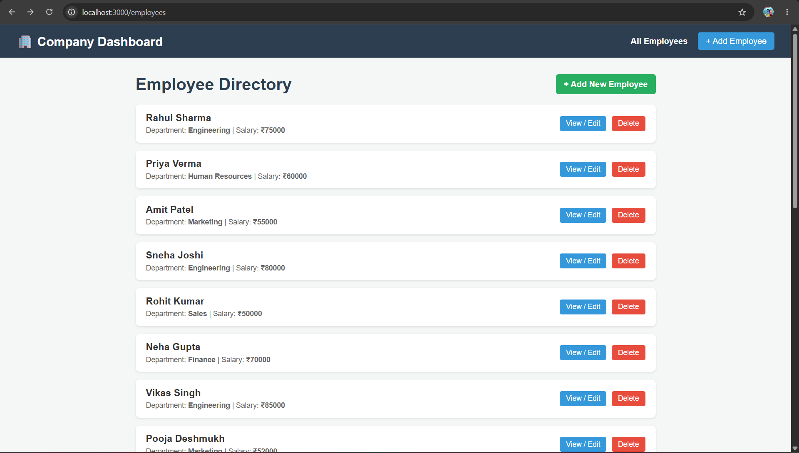
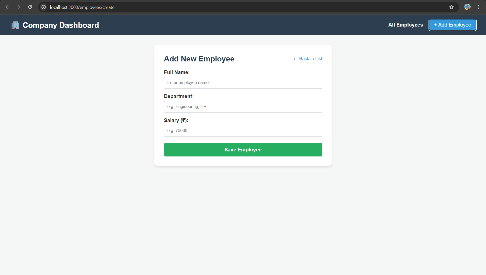
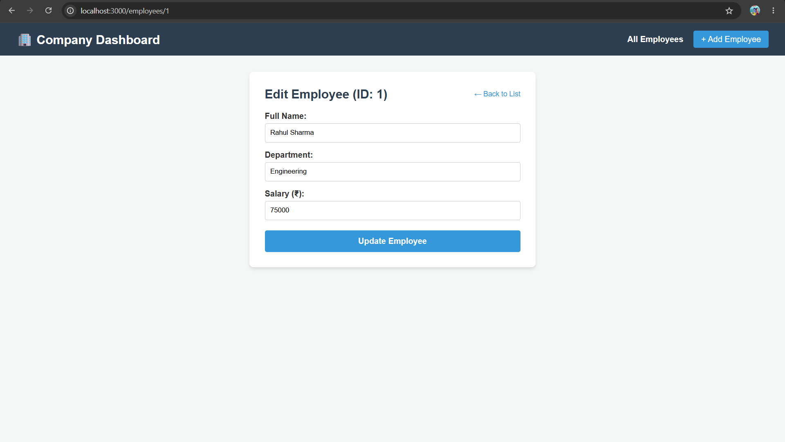

# Day 7: Full-Stack Employee Management Dashboard

## 🚀 Project Overview
A complete full-stack web application built by integrating a **Node.js & Express** backend REST API with a modern **Next.js (App Router)** frontend, designed to manage employee records seamlessly.

## 📌 Problem Statement
To build a modular, decoupled full-stack employee management system where the frontend (Next.js) communicates with a structured backend API (Node.js/Express) to perform full CRUD (Create, Read, Update, Delete) operations on employee data.

## ✨ Features
- **Employee Directory:** View a complete list of all employees (`/employees`).
- **Dynamic Profile/Edit View:** Inspect and update specific employee details via dynamic routes (`/employees/[id]`).
- **Onboarding Form:** Add new employees to the system via a dedicated form (`/employees/create`).
- **RESTful API Integration:** Fully functional backend endpoints handling data persistence and validation.

## 🛠️ Technology Stack
- **Frontend:** Next.js 14 (App Router), React, CSS Modules / Inline Styles
- **Backend:** Node.js, Express.js, CORS
- **Architecture:** Client-Server / Decoupled RESTful API Integration

## 📂 Architecture & Folder Structure
day-07/
├── node-api/         # Backend (Node.js, Express, Port 5000)
│   ├── controllers/  # Request handler logic
│   ├── middleware/   # Custom error handling & logging
│   ├── models/       # Data structures & in-memory dataset
│   ├── routes/       # API route definitions
│   └── services/     # Business logic layer
├── nextjs-app/       # Frontend (Next.js, App Router, Port 3000)
└── README.md         # Documentation

## 🗄️ Database Design (Mock)
The application currently uses an in-memory array data structure inside `employeeModel.js` acting as a mock database. Each employee record contains:
- `id` (String / Unique Identifier)
- `name` (String)
- `department` (String)
- `salary` (Number)

## 📡 API Documentation
| Method | Endpoint | Description |
| :--- | :--- | :--- |
| **GET** | `/employees` | Retrieve all employees |
| **GET** | `/employees/:id` | Retrieve a single employee by ID |
| **POST** | `/employees` | Create a new employee |
| **PUT** | `/employees/:id` | Update an existing employee |
| **DELETE** | `/employees/:id` | Remove an employee record |

## ⚙️ Environment Variables
Create a `.env` file inside the respective folders if needed:
- **Backend (`node-api/.env`):**
  ```env
  PORT=5000
  ```

## Frontend (nextjs-app/.env.local):

NEXT_PUBLIC_API_URL=http://localhost:5000
## 🏃‍♂️ How to Run the Project
1. Run the Backend (node-api)
Open a terminal, navigate to the backend folder, and run:

cd day-07/node-api
npm install
npm run dev
(Server runs on http://localhost:5000)

2. Run the Frontend (nextjs-app)
Open a separate terminal, navigate to the frontend folder, and run:

cd day-07/nextjs-app
npm install
npm run dev
(Application runs on http://localhost:3000/employees)

## screenshots
### 1. Employee Directory Dashboard (`/employees`)


### 2. Add New Employee Form (`/employees/create`)


### 3. Edit Employee View (`/employees/[id]`)


## 🔍 Challenges Faced & Solutions
1. Next.js Dynamic Route Params Handling
Problem: When building the dynamic Edit page (/employees/[id]), navigating or reading route parameters caused runtime issues when unwrapping values incorrectly.

Solution: Accessed route parameters reliably via Next.js App Router conventions, extracting IDs directly to fetch respective records from the backend API successfully.

## 🔮 Future Improvements
Migrate from in-memory mock storage to a persistent database (e.g., MongoDB or PostgreSQL).

Implement user authentication and role-based access control (RBAC).

Enhance UI styling using Tailwind CSS.