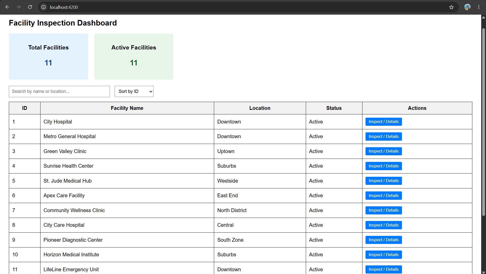
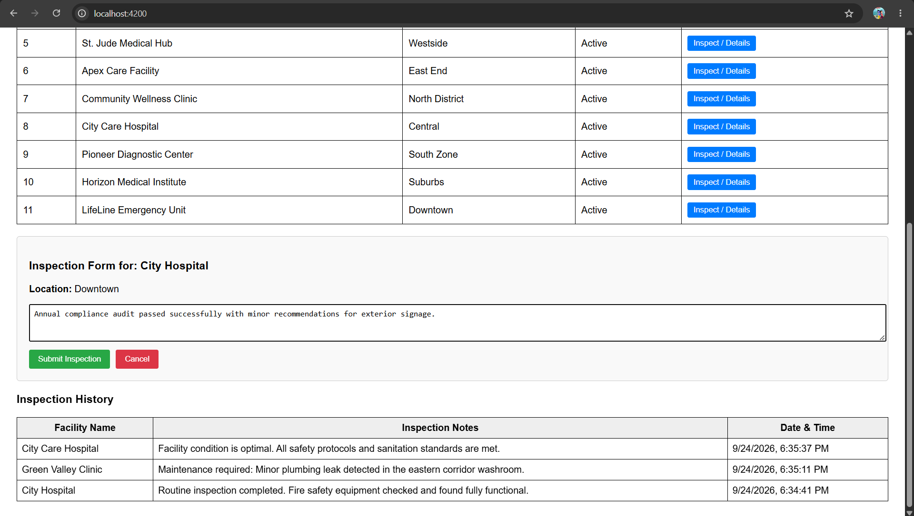

# Facility Inspection Dashboard

## Project Overview
A full-stack web application designed to monitor facilities, track their statuses, and manage facility inspection reports efficiently.

## Problem Statement
Organizations struggle to track facility health and manage inspection records manually. This application solves the problem by providing a centralized digital dashboard with real-time metrics, search capabilities, and a structured inspection logging system.

## Features
- **Dashboard Metrics:** Real-time summary cards for Total Facilities and Active Facilities count.
- **Facility List & Management:** Search, filter, and sort facilities dynamically.
- **Inspection Form & History:** Interactive form to submit inspection notes and a history table to view past logs.
- **REST Interface:** Seamless connection to fetch and save data using a backend API.

## Technology Stack
- **Frontend:** Angular, TypeScript, HTML/CSS
- **Backend:** Laravel (PHP REST API)
- **Database:** MySQL / SQLite

## Architecture
The application follows a clean component-based architecture using Angular services for data handling, TypeScript models for strict type checking, and routes for navigation.

## Database Design
- **Facilities Table:** Stores facility details (`id`, `name`, `location`, `status`, timestamps).
- **Inspections Table:** Stores inspection records linked to facilities (`id`, `facility_id`, `notes`, `status`, timestamps).

## API Documentation
- `GET /api/facilities` - Fetches all facility records.
- `GET /api/facilities/{id}` - Fetches a specific facility's details.
- `POST /api/inspections` - Submits a new inspection report.

## Installation
1. Clone or download the project workspace.
2. Ensure Node.js and PHP/Composer are installed on your system.

## Environment Variables
- Angular: Configured via environment files for API base URLs (`http://127.0.0.1:8000/api`).
- Laravel: Configured via `.env` file for database connections (`DB_DATABASE`, etc.).

## How to Run
1. **Start Backend:** Open terminal in the Laravel folder and run `php artisan serve`.
2. **Start Frontend:** Open terminal in the `angular-app` folder, run `npm install` (if first time), and then `ng serve`. Open `http://localhost:4200` in your browser.

## Screenshots

### 1. Facility Inspection Dashboard - Overview & List

### 2. Inspection Form & History

## Challenges Faced
- Managing mass assignment security restrictions in the Laravel backend while seeding data.
- Handling asynchronous data flow between the Angular frontend and the REST API.

## Solutions
- Updated the `$fillable` property inside the Laravel model to explicitly allow mass assignment.
- Utilized Angular services with `HttpClient` to manage asynchronous HTTP requests cleanly.

## Future Improvements
- Add user authentication and role-based access control (Admin vs Inspector).
- Implement data export features (PDF/Excel reports for inspections).