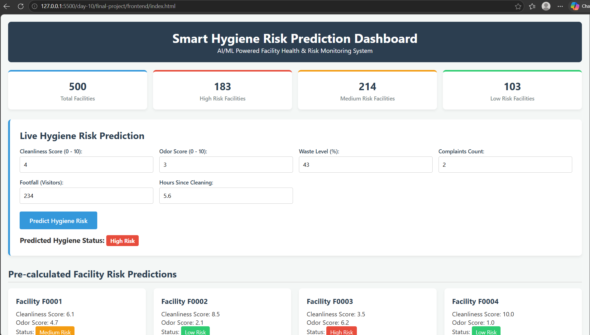
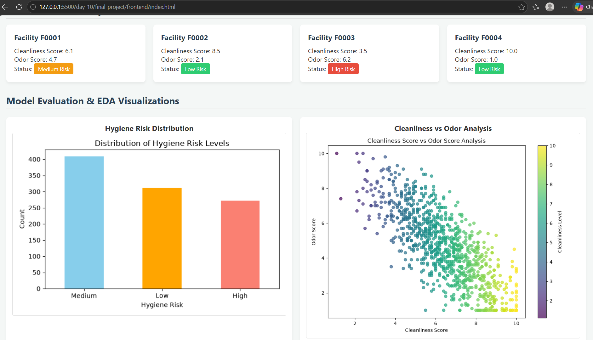

# Smart Hygiene Risk Prediction System (Day 10 Final Project - AI/ML Path)

## Project Overview
This project is developed as part of the 10-Day Intern Technical Training and Domain Assessment Program (AI/ML Domain). It implements an end-to-end Machine Learning pipeline designed to evaluate facility cleanliness parameters, analyze operational risks, and predict hygiene risk classifications (Low, Medium, High).

## Problem Statement
Manual facility hygiene monitoring is labor-intensive, inconsistent, and reactive. This system automates hygiene risk prediction using operational metrics such as cleanliness scores, odor levels, waste accumulation, complaints, and footfall to enable proactive facility management.

## Features
- **Dynamic Data Ingestion:** Handles CSV datasets dynamically to support future dataset replacements without code alterations.
- **Data Preprocessing:** Cleans missing values and encodes categorical features using robust label encoding.
- **Exploratory Data Analysis (EDA):** Calculates statistical summaries and feature correlations with hygiene risk.
- **Model Training & Evaluation:** Trains and compares classifiers with detailed performance reports.
- **Batch Predictions:** Generates risk status predictions for all facilities and exports them into a structured CSV file.
- **Visualizations:** Generates distribution bar charts and feature scatter plots.
- **Bonus API Integration:** Exposes trained model predictions dynamically through a backend script.

## Technology Stack
- **Language:** Python
- **Libraries:** Pandas, Scikit-Learn, Matplotlib
- **Environment:** Standard Python Virtual Environment

## Architecture & Project Structure
```text
final-project/
├── frontend/             # Responsive UI dashboard mockup (index.html)
├── backend/              # API and backend prediction logic (app.py)
├── database/             # Database schema definition (schema.sql)
├── ml/                   # Machine Learning pipeline
│   ├── dataset/          # Raw dataset storage (.csv)
│   ├── preprocessing/    # Cleaned datasets
│   ├── eda/              # EDA scripts & reports
│   ├── models/           # Training scripts & reports
│   ├── evaluation/       # Performance evaluation reports
│   ├── predictions/      # Generated risk predictions CSV
│   └── visualization/    # Generated plots & charts (.png)
├── screenshots/          # Dashboard visual proofs
│   ├── dashboard_preview1.png
│   └── dashboard_preview2.png
└── README.md
```

## Database Design
The relational database structure (database/schema.sql) includes:

facilities Table: Stores unique facility metadata (facility_id, location, facility_type).

hygiene_inspections Table: Stores operational metrics per inspection (inspection_id, facility_id, cleanliness_score, odor_score, waste_level, water_availability, footfall, complaints, hours_since_cleaning, hygiene_risk, inspection_date) linked via Foreign Key.

## API Documentation (Bonus)
Endpoint / Script: backend/app.py

Method: Python function invocation / REST simulation

Input Parameters: cleanliness_score, odor_score, waste_level, complaints, footfall, hours_since_cleaning

Output: Predicted hygiene risk string (Low, Medium, or High)

## Installation
No external heavy databases or cloud keys are required. Ensure Python and standard dependencies are installed:

pip install pandas scikit-learn matplotlib
Environment Variables
No environment variables (.env) are required for local execution.

## How to Run
Preprocess Data: python ml/preprocessing/preprocess_data.py

Run EDA: python ml/eda/eda_features.py

Train Models: python ml/models/train_model.py

Generate Predictions: python ml/predictions/generate_predictions.py

Generate Visualizations: python ml/visualization/visualize_data.py

Test Backend API: python backend/app.py

## Screenshots
### 2. Frontend UI Mockup (`screenshots/`)



## Challenges Faced
Dependency Handling: Missing optional spreadsheet libraries initially caused file-reading errors.

Model Convergence: Initial iteration limits were reached during model training.

## Solutions
Solution 1: Converted and standardized inputs into clean CSV formats to ensure zero-dependency friction across different machine environments.

Solution 2: Optimized solver parameters and model iteration caps for stable execution.

## Future Improvements
Integrate a full web framework (such as FastAPI or Flask) for live HTTP REST endpoints.

Connect a full-stack frontend dashboard to consume the live prediction API.

Implement deep learning models for advanced time-series hygiene trend forecasting.